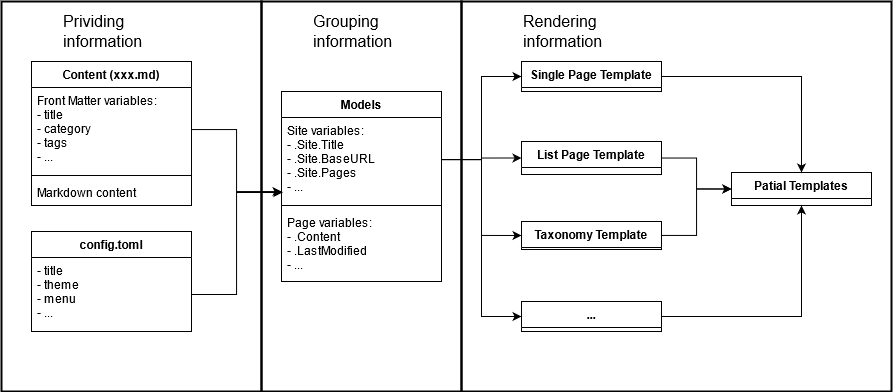

I've built a [Hugo](https://gohugo.io/) theme, [yBlog](https://coderyihaowang.github.io/yBlog), for my personal blog. Here are some takeaways.

## Mental model

As a content writer, we write contents in markdown, put them in correct folders, add some meta-data in front matter, and that's it. Hugo takes care of everything else for us. But if we want to build our own themes, we need to understand a bit more about how Hugo works behind the scenes. The below diagram show my mental model when I use Hugo:



This is perhaps an over-simplified version of Hugo's work flow. If you look at [Hugo's source code](https://github.com/gohugoio/hugo), you'll find the actual implementation much more complicated. But I find this mental model helpful for getting us thinking in Hugo. 

To summarise Hugo's model in one sentence: **everything is a page**, and every page has a corresponding model that provides all the information needed to render it. This model is really the central piece of Hugo's flow. Everything you write will become its fields, and everything you see on the rendered pages are retrieved from it. You provide data to the model by writing markdown (including front matter), and you retrieve data in the templates by accessing the model's fields and methods. But please note that this "model" only exists in our mental model, the real implementation is much more sophisticated. You can refer to [variables in hugo](https://gohugo.io/variables/), they are corresponding to the "fields" that we are talking about here.

So, let's have a closer look at the data flow around this model, it can be separated into three steps (as shown in the diagram above):

1. Hugo parses the markdown contents and the front matter, as well as the config file, gathering information into models (providing information)

2. Models are mapped to corresponding templates (grouping information)

3. Templates consume the information carried in the models, rendering them in HTML (rendering information)

## Providing information

Information is the raw material for building the website. They come from 3 sources: the content markdown files, the `config.toml/yaml/json` file, and the Hugo engine.

### Information in contents

The most notable piece of information is the markdown content itself. This content will be available as a page variable, and can be retrieved using `.Content` in the page template (will explain shortly).

We are also able to provide other information that is specific to a particular page. These are added as [front matter](https://gohugo.io/content-management/front-matter) at the top of the content file. Some fields are [predefined](https://gohugo.io/content-management/front-matter#front-matter-formats) by Hugo, including `title`, `description` and so on. When they are defined in the front matter, they are available for use in templates via their names (eg `.Title`, `.Description`, ...). 

Other than these predefined fields, we can also add whatever information we want to front matter. These user-defined fields will also be available in the page template. They are grouped together in the `.Params` field. For example, if we add a `note` field to front matter, as this is not Hugo predefiend, we can later use it via `.Params.Note` in the templates.

### Information in config

We'll also need some information that are website-wise, for example, the base URL of the website, the website's author, etc. They belong to the `config.toml` file. When you provide these fields in the config file, they become available via the `.Site` template variable. For example, `baseURL = 'https://my.domain'` in `config.toml` becomes `.Site.BaseURL` in the templates.

### Information from Hugo engine

During the building process, Hugo also adds a great amount of helpful information for us to use in templates. These include `.Permalink`, `.TableOfContents`, `.WordCount`, `.ReadingTime` and many more. Refer to the documentation of [page variables](https://gohugo.io/variables/page/) and [site variables](https://gohugo.io/variables/site/) to see what else are available.

## Grouping information

The information gathered from the above step will be grouped into models and dispatched to templates. Basically, the templates come in two versions (`Kind`s, in Hugo's term): single page templates and list templates.

**Single page templates** display individual contents. For example, a single markdown file that you put under the contents folder, will be forwarded to a single page template.

**List templates** don't display the content of an individual content file; they are used to provide a summary page of a certain collection. For example, section, taxonomy, etc. That said, you CAN create a file corresponding to a particular list template; this way, you can provide front matter to the model of a list page. [see here](https://gohugo.io/templates/lists/#add-content-and-front-matter-to-list-pages)

By default, you should see these three default template files under the `layouts/_default` folder:

```
_default/
  |- single.html
  |- list.html
  `- baseof.html
```

`single.html` is the default single page template. Your individual content pages will be rendered by this template. `list.html` is the default list template, you can use it to display the summary of a section. Obviously, Hugo supports many other types of templates, but those are basically special cases of either single page template or list page template. You can read more about Hugo's template lookup order [here](https://gohugo.io/templates/lookup-order/).

Note here `baseof.html` is the base of all other templates. You can add the elements common to all pages here, like the head part of html. Other templates can be embedded inside this one. We'll explain more of template structuring in the next section.

## Rendering information

Finally, the models go to corresponding templates, and we can retrieve the information we provided earlier in the contents and config file. To retrieve a field in model and insert it into the template, put it inside a pair of mustache symbol: `{{  }}`. For example, `<h1>{{ .Title }}</h1>` in the template will be rendered as `<h1>[value of the model's 'title' field]</h1>` in the final output. Hugo uses Go's [templating language](https://golang.org/pkg/text/template/), which is very powerful and interesting to work with. You can read about it in [Hugo's documentation](https://gohugo.io/templates/introduction/).

Hugo's templates can be embedded and make use of [partials](https://gohugo.io/templates/partials/) to reuse components. To show an example, here is the `baseof.html` of my theme:

```html
<!DOCTYPE html>
<html class="sticky" id="root">
    {{- partial "head.html" . -}}
    <body>
        {{- partial "header.html" . -}}
        <div id="content">
        {{- block "main" . }}{{- end }}
        </div>
        {{- partial "footer.html" . -}}
        {{- partial "script.html" . -}}
    </body>
</html>
```

The `{{- block "main" . }}{{- end }}` part shows how to embed a template. My `_default/single.html` file is defined as:

```html
{{ define "main" }}
    <!-- content of a single page -->
{{ end }}
```

The content of the single page template will be inserted into `baseof.html` template in the `block "main" .` part. The dot (`.`) after `"main"` is the context passed to embedded templates (similar to function argument, but each template only has one context).

The `{{- partial "script.html" . -}}` part shows how to use partial templates. I have created a `script.html` template under the `partials` folder with the following content:

```html
{{ $script := resources.Get "/js/script.js" | minify }}
<script src="{{ $script.RelPermalink }}"></script>
```

This piece will be inserted into the `partial "script.html ."` part.

## Wrap up

Right, that's it. This article is not a step-by-step toturial but aims to provide a high level overview of how Hugo works. It summarises what I learned so far, and hopefully it will be useful when I leave Hugo for some time and come back one day. For detailed information on Hugo, go to the [documentation](https://gohugo.io/documentation/), and they also have a good [tutorial](https://gohugo.io/getting-started/quick-start/) to get you started.